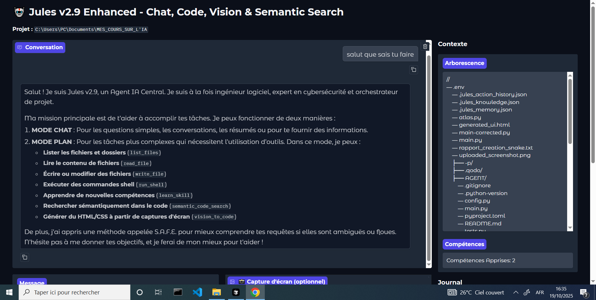

# 🧠 Jules v2.9 Enhanced

### L’agent IA qui **voit, cherche, code, apprend… et t’épate.**

---

## 💰 Soutenir le projet

Si **Jules t’impressionne** ou te fait gagner du temps, tu peux **m’encourager directement** 💪

| Moyen de soutien                        | Détail                                                                                      |
| --------------------------------------- | ------------------------------------------------------------------------------------------- |

| 💳 **Paiement automatique via Chariow** | 👉 [https://brwqjjmk.mychariow.shop/israel-ltd](https://brwqjjmk.mychariow.shop/israel-ltd) |

> 💡 Chaque dépot aide à **développer des nouvelles fonctions IA**, et maintenir **la version open source** gratuite pour tous.
> Merci pour ton soutien 🙏

---

[vision-demo](docs/ia.PNG)

---

## ⚡ Pourquoi Jules est différent

| ✨ Fonctionnalité                 | 🔍 Ce que ça fait                                                                             | 🎯 Pourquoi tu vas l’adorer                                   |
| -------------------------------- | --------------------------------------------------------------------------------------------- | ------------------------------------------------------------- |
| **Vision** 📸                    | Glisse une **capture d’écran** → Jules génère le **HTML/CSS** correspondant en 5 secondes.    | Crée une maquette complète **sans taper une ligne de code**.  |
| **Recherche sémantique** 🔎      | « *Où est géré le token JWT ?* » → Jules **comprend le sens** et te montre les bons fichiers. | Oublie `grep` et les 300 faux résultats.                      |
| **Apprentissage personnel** 🧠   | Tu lui apprends une règle une fois → il **s’en souvient pour toujours**.                      | Il devient **ton assistant personnel**, pas un bot générique. |
| **Patch intelligent** ✏️         | Modifie ton code **sans tout réécrire** (log, try/except, décorateurs, etc.).                 | Historique Git propre + Review ultra claire.                  |
| **Auto-commit & push** 🚀        | Chaque action = **commit + push automatique**.                                                | Plus de “WIP fix lol”.                                        |
| **Interface web recommandée** 🌐 | Interface **moderne avec Gradio** : chat, arborescence, logs en direct, aperçu image.         | **Tout se fait dans le navigateur**, sans terminal.           |

> 💡 **Recommandé :** Utilise toujours la **version web** (`python main.py --web`) pour profiter de toutes les fonctionnalités (vision, logs, interface fluide, upload d’images).

---

## 📸 Aperçu visuel

| Capture → Code              | Recherche intelligente                 | Patch automatique                  |
| --------------------------- | -------------------------------------- | ---------------------------------- |
|  |  |  |

> Les démos sont légères (<2 Mo chacune). Clique dessus pour voir la **vitesse réelle** d’exécution.

---

## ⚙️ Installation ultra-rapide

```bash
# 1️⃣ Clone le dépôt
git clone https://github.com/Reacknadam/agent-ia.git  
cd agent-ia

# 2️⃣ Active ton environnement (optionnel mais recommandé)
python -m venv venv && source venv/bin/activate  # Sous Windows : venv\Scripts\activate

# 3️⃣ Installe les dépendances
pip install -r requirements.txt
# Contient : google-genai, gradio, rich, sentence-transformers, pillow, pyyaml, vulture, ruff

# 4️⃣ Configure ta clé API Gemini
# (à obtenir ici : https://aistudio.google.com/app/apikey)
export GEMINI_API_KEY="ta_clé_api"

# 5️⃣ Lance Jules
python main.py --web  # ✅ Version Web (recommandée)
# ou
python main.py        # Mode terminal (CLI)
```

---

## 🎯 Exemples express

| Tu dis…                                                          | Jules fait…                                   |
| ---------------------------------------------------------------- | --------------------------------------------- |
| « *Ajoute un log DEBUG après le calcul de total dans maths.py* » | Localise la ligne, insère, valide et commit.  |
| « *Maquette cette capture* »                                     | Génère `generated_ui.html` + `tailwind.css`.  |
| « *Où est la validation des tokens ?* »                          | Trouve fichiers + lignes précises.            |
| « *Corrige les imports et applique ruff* »                       | Lint, corrige, commit.                        |
| « *Apprends que je veux un @timer sur mes fonctions lentes* »    | Jules l’appliquera automatiquement plus tard. |

---

## 📁 Structure du projet

```
jules-v2/
├── main.py                 # Code principal (monofichier, lisible)
├── requirements.txt
├── docs/                   # Images & GIFs
│   ├── jules-banner.png
│   ├── vision-demo.gif
│   ├── semantic-demo.gif
│   └── patch-demo.gif
├── README.md               # ← Ce fichier
└── .gitignore
```

---

## 🧪 Qualité & Tests

```bash
# Lint + auto-fix
ruff check --fix main.py

# Vérification sécurité
bandit -r main.py

# Benchmark (projets tests intégrés)
python main.py --benchmark
```

---

## 🛣️ Roadmap

* [ ] Support **Vue.js / React** pour le Vision-to-Code
* [ ] **Input vocal (Whisper local)**
* [ ] **Plugins externes** (`jules-plugin-django`, `jules-plugin-fastapi`)
* [ ] **Mode équipe** : partage des apprentissages entre membres

---

## 📜 Licence

**MIT License** — libre d’utilisation, même pour un usage commercial.

---

**⭐ Star le repo** si Jules t’a déjà fait gagner **5 minutes ou plus**.
**🔔 Watch** le projet pour ne rien manquer des prochaines innovations.
